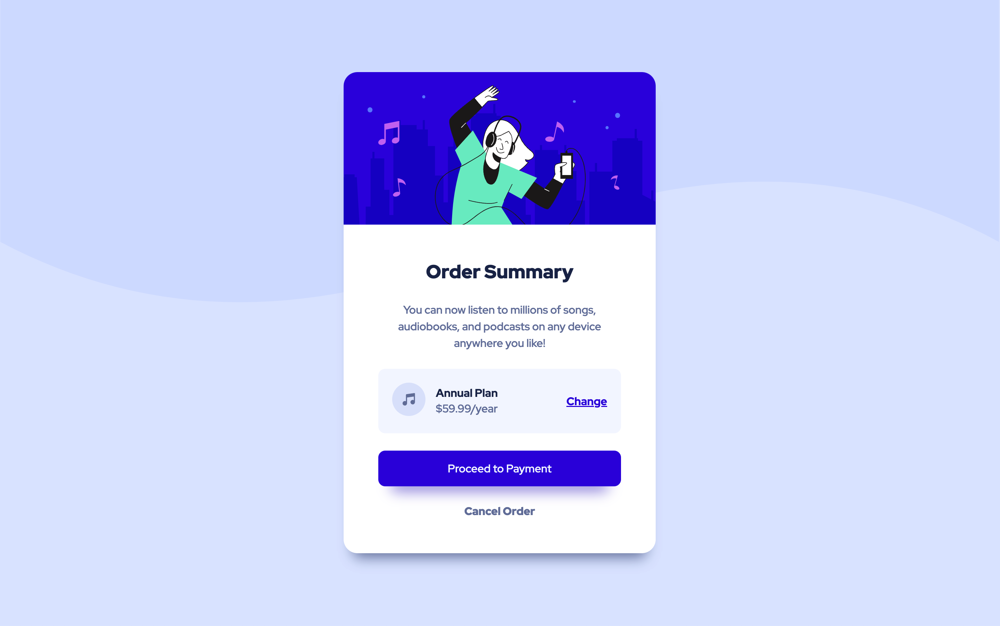

# Frontend Mentor - Order summary component solution

This is a solution to the [Order summary component challenge][Order-Summary-challenge] on Frontend Mentor

<!-- Table of Content -->

 

Table of contents

-   [Overview](#overview)
    -   [Screenshot](#screenshot)
    -   [Links](#links)
-   [My process](#my-process)
    -   [Built with](#built-with)
    -   [What I learned](#what-i-learned)
    <!-- -   [Continued development](#continued-development) -->
-   [Author](#author)
-   [Acknowledgments](#acknowledgments)

## Overview

### Screenshot

### Links

-   Solution URL: [Github/Order-Summary](https://github.com/Genrex7/Frontend-Mentor-Order_summary_component)
-   Live Site URL: [Order-Summary](https://genrex7.github.io/Frontend-Mentor-Order_summary_component/)

## My process

### Built with

-   ![HTML][HTML]
-   ![CSS][CSS]

### What I learned

I learned that organizing HTML elements well using &lt;div&gt;, &lt;img&gt;, and &lt;p&gt; tags makes the code clearer.

With CSS, applying box-shadows and setting the border-radius to 15px made the component look more modern and stylish.

Making sure the component looks good on different devices was important. Setting the width and height to 100vw and 100vh made it adapt well to different screen sizes. Overall, this project helped me learn a bunch of modern web design tricks that made my Order summary component both stylish and functional.

## Author

-   Frontend Mentor - [@Github7](https://www.frontendmentor.io/profile/Genrex7)
-   Twitter - [@MeenaKDeepak](https://www.twitter.com/MeenaKDeepak)

## Acknowledgments

[![Frontend Mentor][fronendmentor]][Order-Summary-challenge]

[Order-Summary-challenge]: https://www.frontendmentor.io/challenges/order-summary-component-QlPmajDUj
[HTML]: https://img.shields.io/badge/HTML5-E34F26?style=for-the-badge&logo=html5&logoColor=white
[CSS]: https://img.shields.io/badge/CSS-239120?&style=for-the-badge&logo=css3&logoColor=white
[fronendmentor]: https://img.shields.io/badge/Frontend%20Mentor-3F54A3?style=for-the-badge&logo=frontendmentor&logoColor=white
